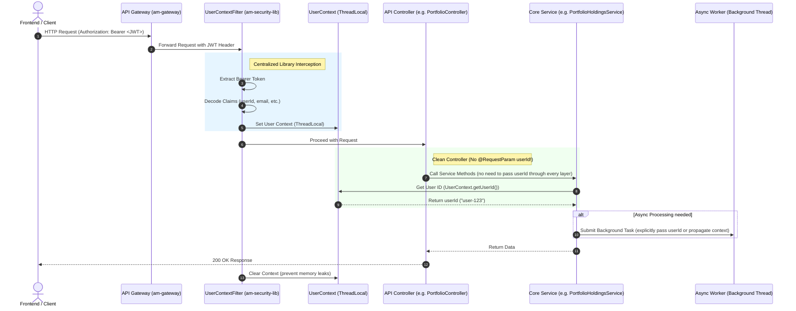

# Centralized Token-Based Authentication Plan (Refined)

This document outlines the architectural plan for implementing a centralized, reusable **User Context and Token Extraction System** within the `am-core-services` repository (specifically in `am-security-lib`).

By centralizing this logic, individual microservices (such as `am-portfolio`, `am-trade`, and `am-market`) will not need to duplicate token parsing, verification, or request interception code. They will simply inherit this dependency and access the current user's security context effortlessly.

---

## Architectural Overview Diagram

The diagram below shows how the centralized security library intercepts requests, populates a thread-safe `UserContext`, and allows any downstream layer (Controllers, Services, or Workers) to access the authenticated user:



## 100% Security Guarantee & Trust Boundary Warning

> [!CAUTION]
> **API Gateway Zero-Trust Dependency**
> The `am-security-lib` currently uses `TokenExtractor.extractAllClaimsUnsafe()`. This method **does not perform cryptographic signature verification** (it only base64 decodes the payload).
> 
> **For this to be 100% secure:**
> 1. The **API Gateway (`am-gateway`)** MUST validate the JWT signature and expiration.
> 2. The downstream microservices (`am-portfolio`, `am-trade`, etc.) MUST be protected within a private VPC network or use mutual TLS so that external traffic cannot bypass the Gateway and hit them directly.
> If a microservice is exposed directly to the public internet without the Gateway, attackers can easily forge a token.

> [!TIP]
> **Foolproof Developer Experience**
> To prevent other developers from forgetting to check if `UserContext.getUserId()` is null (which would cause massive security holes or `NullPointerExceptions`), we are introducing a `getUserIdOrThrow()` method. Developers should **always** use this method, which automatically throws a Spring `ResponseStatusException` (returning a 401 HTTP status) if the token is missing or invalid.

---

## Refinement Highlights (Spring Boot 3 + Dependencies)

During analysis of `am-core-services` parent configuration, we found:
1. **Spring Boot 3.2.3** is in use. Under Spring Boot 3, standard auto-configurations using `META-INF/spring.factories` are deprecated/removed. We must use the modern `META-INF/spring/org.springframework.boot.autoconfigure.AutoConfiguration.imports` path.
2. **Library Classpath Requirements:** `am-security-lib` currently does not depend on Spring Web or Jakarta Servlets. To introduce filters and configurations, we must declare `spring-boot-starter-web` as a `provided` dependency in its `pom.xml`.

---

## Proposed Changes

### 1. Centralized Library (`am-core-services`)

#### [MODIFY] [pom.xml (am-security-lib)](file:///c:/Users/Md%20Sahimuzzaman/Desktop/axrax-v1/am-core-services/libraries/am-security-lib/pom.xml)
Add the Spring Boot Starter Web dependency under `<dependencies>` with a scope of `provided` since any consumer application will provide it at runtime:
```xml
        <!-- Spring Web (For Filters and Configurations) -->
        <dependency>
            <groupId>org.springframework.boot</groupId>
            <artifactId>spring-boot-starter-web</artifactId>
            <scope>provided</scope>
        </dependency>
```

#### [NEW] [UserContext.java](file:///c:/Users/Md%20Sahimuzzaman/Desktop/axrax-v1/am-core-services/libraries/am-security-lib/src/main/java/com/am/security/context/UserContext.java)
Creates a thread-safe ThreadLocal holder for user information:
```java
package com.am.security.context;

import org.springframework.http.HttpStatus;
import org.springframework.web.server.ResponseStatusException;

public class UserContext {
    private static final ThreadLocal<String> userIdHolder = new ThreadLocal<>();
    private static final ThreadLocal<String> emailHolder = new ThreadLocal<>();
    private static final ThreadLocal<String> tokenHolder = new ThreadLocal<>();

    public static void setUserId(String userId) { userIdHolder.set(userId); }
    public static String getUserId() { return userIdHolder.get(); }

    /**
     * Foolproof extraction: Throws a 401 Unauthorized if the user is not authenticated.
     * Use this method in controllers/services to guarantee 100% security enforcement.
     */
    public static String getUserIdOrThrow() {
        String userId = userIdHolder.get();
        if (userId == null) {
            throw new ResponseStatusException(HttpStatus.UNAUTHORIZED, "User not authenticated or token missing");
        }
        return userId;
    }

    public static void setEmail(String email) { emailHolder.set(email); }
    public static String getEmail() { return emailHolder.get(); }

    public static void setToken(String token) { tokenHolder.set(token); }
    public static String getToken() { return tokenHolder.get(); }

    public static void clear() {
        userIdHolder.remove();
        emailHolder.remove();
        tokenHolder.remove();
    }
}
```

#### [NEW] [UserContextFilter.java](file:///c:/Users/Md%20Sahimuzzaman/Desktop/axrax-v1/am-core-services/libraries/am-security-lib/src/main/java/com/am/security/context/UserContextFilter.java)
Implements an HTTP servlet filter to intercept request headers:
```java
package com.am.security.context;

import com.am.security.util.TokenExtractor;
import jakarta.servlet.FilterChain;
import jakarta.servlet.ServletException;
import jakarta.servlet.http.HttpServletRequest;
import jakarta.servlet.http.HttpServletResponse;
import org.springframework.web.filter.OncePerRequestFilter;
import java.io.IOException;

public class UserContextFilter extends OncePerRequestFilter {
    @Override
    protected void doFilterInternal(HttpServletRequest request, HttpServletResponse response, FilterChain filterChain)
            throws ServletException, IOException {
        String authHeader = request.getHeader("Authorization");
        if (authHeader != null && authHeader.startsWith("Bearer ")) {
            try {
                String token = authHeader.substring(7);
                String userId = TokenExtractor.extractUserId(token);
                String email = TokenExtractor.extractEmail(token);
                
                UserContext.setUserId(userId);
                UserContext.setEmail(email);
                UserContext.setToken(token);
            } catch (Exception e) {
                // Log exception but let request proceed - downstream filters/security can block if needed
                logger.warn("Failed to extract user context from token: " + e.getMessage());
            }
        }
        try {
            filterChain.doFilter(request, response);
        } finally {
            UserContext.clear(); // Always clean up thread locals!
        }
    }
}
```

#### [NEW] [UserContextAutoConfiguration.java](file:///c:/Users/Md%20Sahimuzzaman/Desktop/axrax-v1/am-core-services/libraries/am-security-lib/src/main/java/com/am/security/config/UserContextAutoConfiguration.java)
Exposes the filter as a Spring Bean for web-based services:
```java
package com.am.security.config;

import com.am.security.context.UserContextFilter;
import org.springframework.boot.autoconfigure.condition.ConditionalOnWebApplication;
import org.springframework.context.annotation.Bean;
import org.springframework.context.annotation.Configuration;

@Configuration
@ConditionalOnWebApplication
public class UserContextAutoConfiguration {
    @Bean
    public UserContextFilter userContextFilter() {
        return new UserContextFilter();
    }
}
```

#### [NEW] [org.springframework.boot.autoconfigure.AutoConfiguration.imports](file:///c:/Users/Md%20Sahimuzzaman/Desktop/axrax-v1/am-core-services/libraries/am-security-lib/src/main/resources/META-INF/spring/org.springframework.boot.autoconfigure.AutoConfiguration.imports)
Autoloads the context configuration in Spring Boot 3 applications:
```text
com.am.security.config.UserContextAutoConfiguration
```

---

### 2. Microservice Adaptation (`am-portfolio`)

Once the centralized context system is compiled and installed, refactoring any endpoint is very clean:

#### [MODIFY] [PortfolioController.java](file:///c:/Users/Md%20Sahimuzzaman/Desktop/axrax-v1/am-portfolio/portfolio-api/src/main/java/com/portfolio/api/PortfolioController.java)
1. **Remove** `@RequestParam String userId` from all endpoints.
2. Inside methods, query `UserContext.getUserIdOrThrow()` for 100% secure, guaranteed user-specific lookups.
   * *Example:*
     ```java
     @GetMapping
     public ResponseEntity<List<PortfolioModelV1>> getPortfolios() {
         // This single line guarantees security. If token is absent/invalid, 
         // Spring automatically returns 401 Unauthorized.
         String userId = UserContext.getUserIdOrThrow(); 
         
         List<PortfolioModelV1> portfolios = portfolioService.getPortfoliosByUserId(userId);
         return ResponseEntity.ok(portfolios);
     }
     ```

#### [MODIFY] [BasketController.java](file:///c:/Users/Md%20Sahimuzzaman/Desktop/axrax-v1/am-portfolio/portfolio-api/src/main/java/com/portfolio/api/BasketController.java)
1. Inside `resolveUserHoldings`, fetch `UserContext.getUserId()` directly instead of pulling from the body payload's `userId`.

---

## Verification Plan

### Automated Tests
1. Run `mvn clean install -pl libraries/am-security-lib -am` inside `am-core-services` to build and verify compilation of the refined security library.
2. In the microservice workspace, rebuild `am-portfolio` to ensure it integrates seamlessly with the new dependencies.

### Manual Verification
1. Run the Gateway and the Portfolio service locally.
2. Send request to `/v1/portfolios` **without** query params but **with** header `Authorization: Bearer <token>`.
3. Verify the user identity is resolved and correct portfolios are retrieved.
4. Ensure no thread-leak context issues occur.
